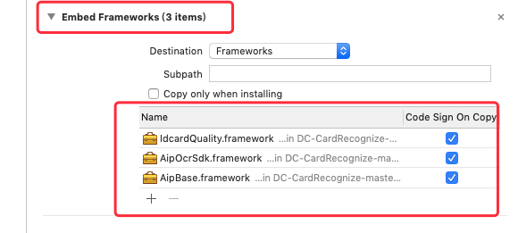

# DC-CardRecognize

## 简介
DC-CardDetect插件是基于百度文字识别SDK创建的uni插件，该插件现已支持身份证正反面识别，银行卡识别，车牌号识别。

### 准备
请前往[百度开发平台](http://ai.baidu.com/tech/ocr)申请账号，出于安全考虑，百度推荐使用授权文件方式进行开发者认证，请各位开发者申请应用之前务必认真阅读文档[http://ai.baidu.com/docs#/OCR-Android-SDK/7bb09719](http://ai.baidu.com/docs#/OCR-Android-SDK/7bb09719)。

**下载License文件授权文件** <br>
应用创建成功之后，点击应用列表，选择已创建的应用对应的管理按钮，点击管理按钮 <br>

- “下载License文件-iOS（文字识别）”，将下载下来的License文件替换插件目录DC-CardDetect/ios/中的同名文件。

**重要：插件中自带aip.license为测试使用，切记换成申请的License**

### 须知

百度文字识别对所有用户均提供每天有限次数的免费使用服务，如有更大需求，需开通付费。

当前插件基于网络使用，使用时请确保网络通畅。


##  此工程运行方法
- clone 本工程（或下载）

  `git clone https://github.com/xiaohuapunk/DC-CardRecognize.git`

- 将工程放到 5+离线SDK的 `HBuilder-uniPluginDemo` 工程目录中
  

- 双击打开`HBuilder-uniPluginDemo`工程，将插件工程引入到 `HBuilder-uniPluginDemo` 工程中
> 选择工程文件 -> 右键->add flie to ... -> 在插件工程目录中选择插件工程文件 -> Add 
   
  
	
- 将插件资源文件 `aip.license` 添加进工程
  
	
- 将插件工程添加到主工程依赖中
  
	
- 将插件库及所依赖的第三方库添加到主工程
> **注：**百度ocr所用到的三个库均为动态库，所以需要在 `Link Binary With Libraries` 和 `Embed Frameworks` 中同时引入
	
  
	
  
	

- 在 HBuilder-Integrate-Info.plist 的 `dcloud_uniplugins` 节点下添加如下配置

  ```
<dict>
	<key>hooksClass</key>
   	<string></string>
   	<key>plugins</key>
        <array>
            	<dict>
                    <key>class</key>
                    <string>DCCardDetectModule</string>
                    <key>name</key>
                    <string>DC-CardDetect</string>
                    <key>type</key>
                    <string>module</string>
              </dict>
      </array>
</dict>
```

- 添加相册，及相机使用权限
	- "NSCameraUsageDescription",
	- "NSPhotoLibraryUsageDescription"

- 工程已配置完成（注百度ocr库只支持 **真机运行** **真机运行** **真机运行**）

- 请在`HBuilderX`自行编写测试工程，然后导出离线资源，放入到工程中进行测试

### Api 说明

**引用方式**

`const card = uni.requireNativePlugin('DC-CardRecognize');`

**方法说明**

`startRecognize(options,callback)`
> 点击会跳页扫描

参数说明

参数|	类型|	参数说明|
:--|:--|:--|
options|	json|	参数配置
callback|	function|	返回识别结果

options{object}

参数|	类型|	可选参数|
:--|:--|:--|
maskType|	String|	IDCardFront（身份证正面）、IDCardBack（身份证背面）、BankCard（银行卡）、BusinessCard（名片）、LicensePlate（车牌）

callback返回数据（数据为JSON格式，仅解释通用部分，其余部分参数不一一详释）

类型|	说明|
:--|:--|
result|	error（异常）、success（成功）、recognize（识别中）
path|	识别成功后返回的图片路径 (仅android，iOS请自行修改源码添加)

使用方法

```
<template>
    <view>
        <button type="primary" @click="getIDCard()">点击识别身份证</button>
    </view>
</template>

    const card = uni.requireNativePlugin('DC-CardRecognize');
    export default {
        data() {
            return {
            };
        },
        methods: {
            getIDCard() {
                card.startRecognize({
                    maskType:"IDCardFront"
                },result => {
                    console.log(JSON.stringify(result));
                });
            }
        }
    }

<style>
</style>
```
